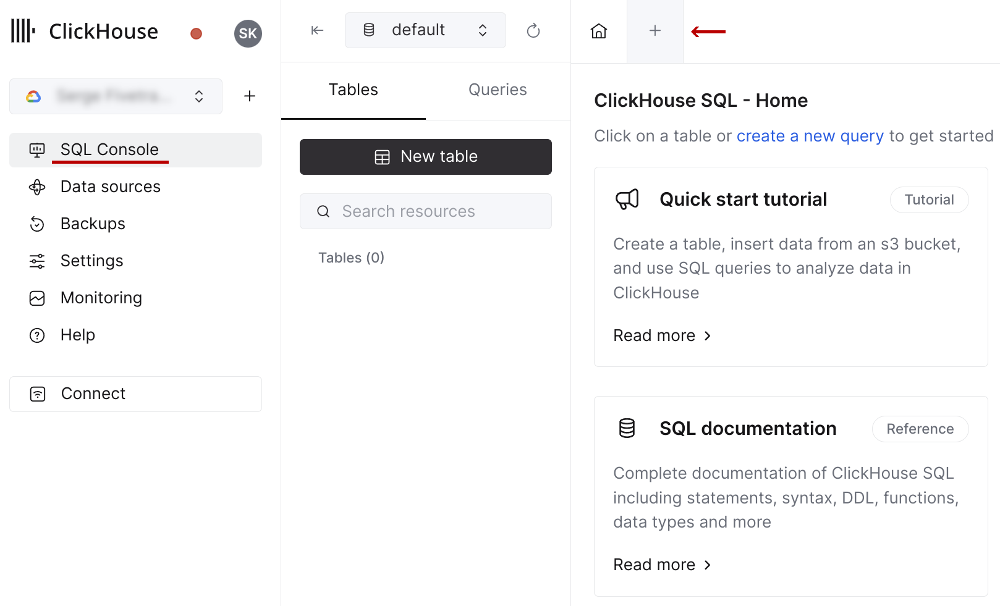
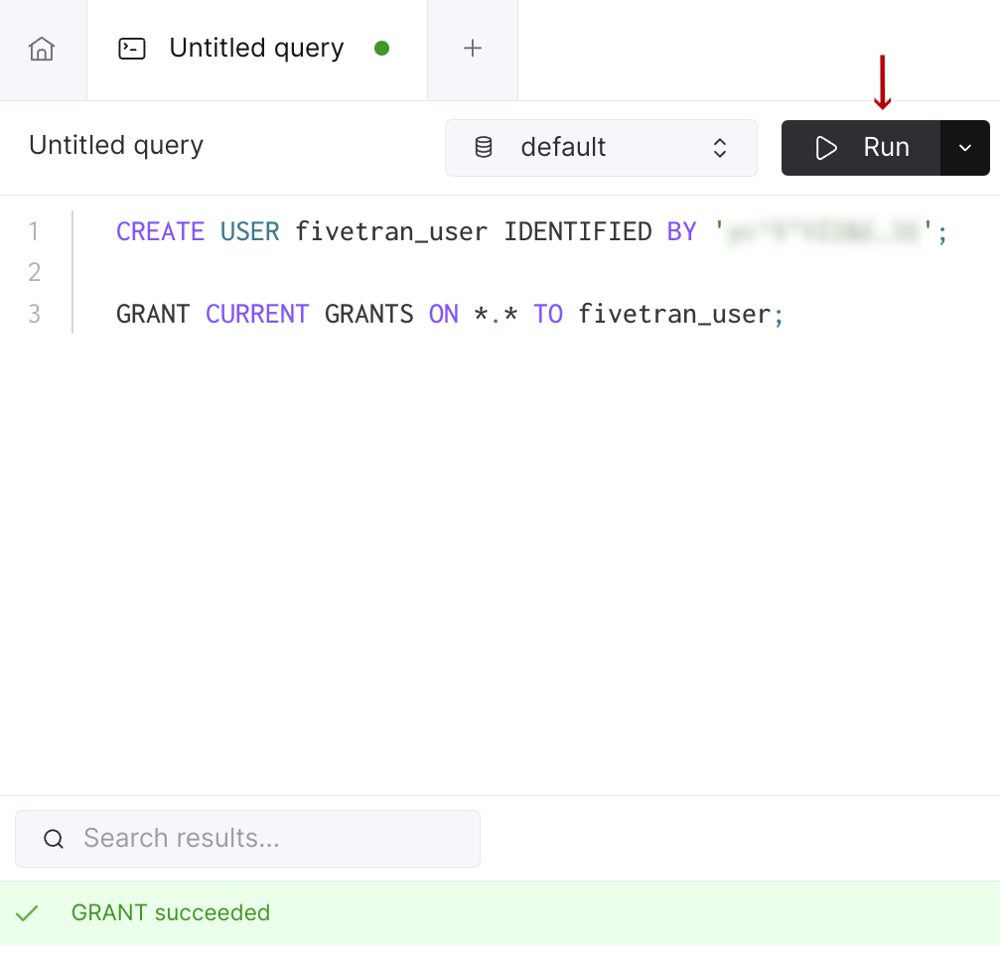
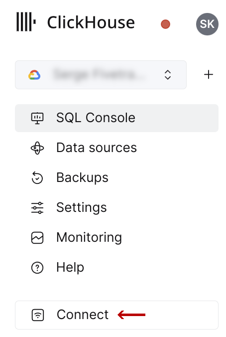
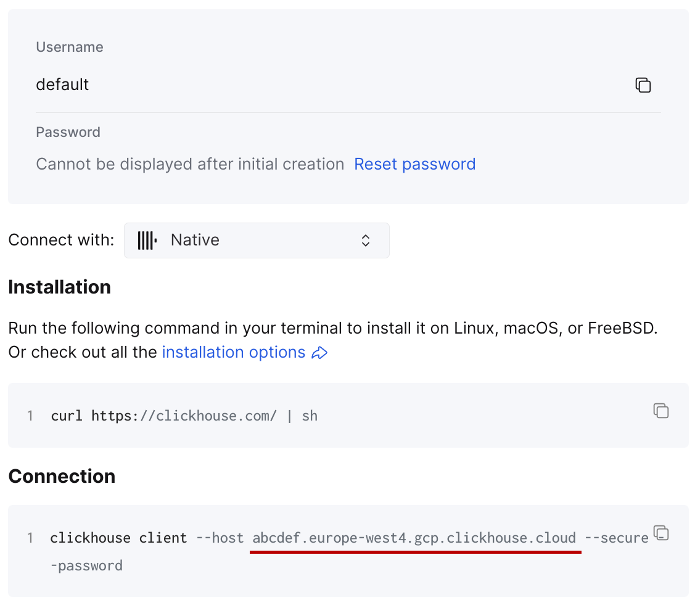

# ClickHouse Cloud Setup Guide  

Follow our setup guide to configure your Fivetran destination for ClickHouse Cloud.

> NOTE: This destination is [partner-built](/docs/partner-built-program). For any questions related to ClickHouse Cloud
> destination and its documentation, contact [ClickHouse Cloud Support](mailto:support@clickhouse.com).

---

## Prerequisites

To connect Fivetran to ClickHouse Cloud, you will need the following:

- A Fivetran account with 
  [permission to add destinations](/docs/using-fivetran/fivetran-dashboard/account-management/role-based-access-control#legacyandnewrbacmodel).
- A ClickHouse Cloud service. You can follow the [Quick Start Guide](https://clickhouse.com/docs/en/cloud-quick-start).
  When the service is created, make sure to copy the `default` user credentials - the password will be shown only once.
- (Recommended) Consider not using the `default` user; instead, create a dedicated one to use it with this Fivetran
  destination only. The following commands, executed with the `default` user, will create a new `fivetran_user` with the
  required privileges.

   ```sql
   CREATE USER fivetran_user IDENTIFIED BY '<password>'; -- use a secure password generator

   GRANT CURRENT GRANTS ON *.* TO fivetran_user;
   ```

  You can execute these statements in the ClickHouse Cloud SQL console. Click on your service in the services list, and
  then press the "SQL Console" button on the left sidebar. Click the "+" button to add a new query.

  

  Paste the SQL statements into the query editor, replace the `<password>` placeholder with a password of your choice, 
  and press the "Run" button.

  

  Now, you should be able to use the `fivetran_user` credentials in the destination configuration.

---

## Gathering the connection details

You can find the hostname of your service in the ClickHouse Cloud console. Click on your service in the services list,
and then press the "Connect" button on the left sidebar.



In the connection window, select "Native". The hostname required for the destination configuration matches the `--host`
argument for the CLI client. It is defined with the following format: `<service>.<region>.<provider>.clickhouse.cloud`.



The port required for the destination configuration is ClickHouse native secure port, which is `9440` for most
instances.

---

## Destination configuration

1. Log in to your Fivetran account.
2. Go to the [**Destinations** page](https://fivetran.com/dashboard/destinations), and then click **+ Add Destination**.
3. Choose a **Destination name** of your choice.
4. Click **Add**.
5. Select **ClickHouse** as the destination type.
6. Enter your ClickHouse Cloud service hostname.
7. Enter your ClickHouse Cloud service port.
8. Enter the credentials of the user.
9. Click **Save & Test**.

Fivetran will run the connectivity check with your ClickHouse Cloud service using the provided credentials. If it
succeeded, you can start ingesting the data into your ClickHouse Cloud service using Fivetran connectors.

In addition, Fivetran automatically configures a [Fivetran Platform Connector](/docs/logs/fivetran-platform) to transfer
the connector logs and account metadata to a schema in this destination. The Fivetran Platform Connector enables you to
monitor your connectors, track your usage, and audit changes. The connector sends all these details at the destination
level.